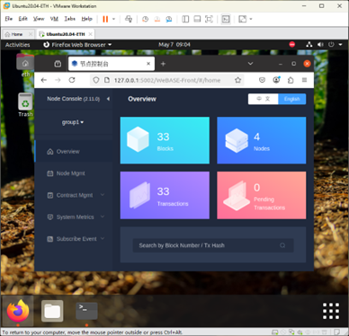
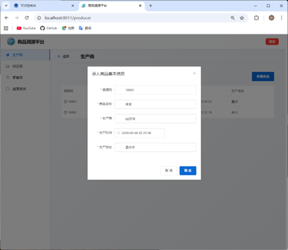
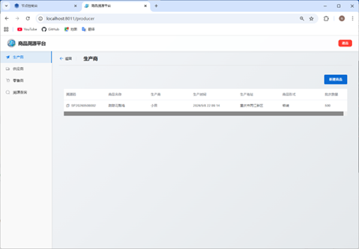
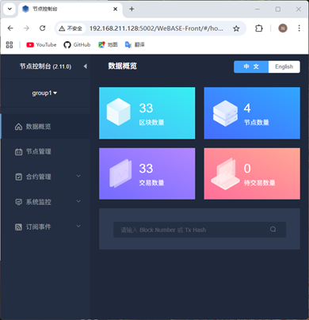
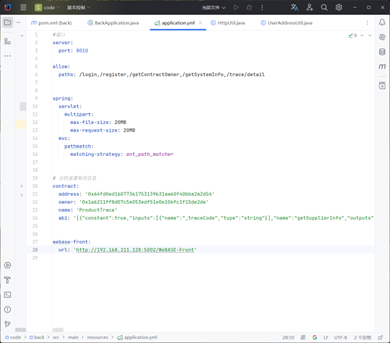
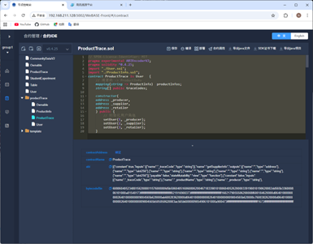
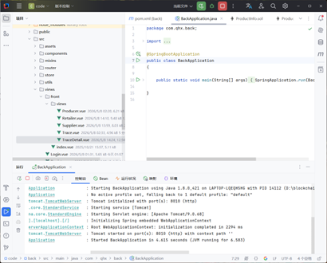
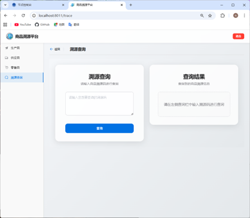

<p align="center">
  
</p>

<h1 align="center">TraceChain</h1>

<p align="center">
  <strong>基于 FISCO BCOS 的区块链商品溯源平台</strong>
  <br>
  <em>AI 协同开发的联盟链全生命周期可信追溯系统</em>
</p>

<p align="center">

<!-- Tech Badges -->

<a href="#"></a>
<a href="#"></a>
<a href="#"></a>
<a href="#"></a>
<a href="#"></a>
<a href="#"></a>
<a href="#"></a>

</p>

<p align="center">
  <a href="#-项目简介">项目简介</a> •
  <a href="#-页面展示">页面展示</a> •
  <a href="#-技术架构">技术架构</a> •
  <a href="#-智能合约">智能合约</a> •
  <a href="#-ai-agent-协同开发">AI Agent</a> •
  <a href="#-快速开始">快速开始</a> •
  <a href="#-项目结构">项目结构</a> •
  <a href="#-问题与解决方案">问题与解决方案</a>
</p>

---

## 📋 项目简介

**TraceChain** 是一个基于 **FISCO BCOS** 联盟链的全栈商品溯源系统，旨在构建**可信的供应链数据基础设施**。系统利用区块链的不可篡改特性，记录商品从生产到销售的全生命周期流转信息，为消费者提供透明可信的溯源查询服务。

### 业务流程

```
生产商 → 供应商 → 零售商 → 消费者溯源查询
```

| 角色      | 操作               | 链上数据                     |
| --------- | ------------------ | ---------------------------- |
| 👨‍🌾 生产商 | 商品录入、批次管理 | 商品基本信息、生产地址、时间 |
| 🚚 供应商 | 入库登记、质检记录 | 物流信息、质检结果           |
| 🛒 零售商 | 零售入库、最终流转 | 零售记录、销售信息           |
| 👤 消费者 | 输入溯源码查询     | 查看全链路数据               |

### 核心特性

| 特性                | 说明                                                           |
| ------------------- | -------------------------------------------------------------- |
| 🔗 **可信溯源**     | 每一条供应链数据均通过 Solidity 智能合约写入 FISCO BCOS 区块链 |
| 🛡️ **数据不可篡改** | 联盟链共识机制确保上链数据无法被篡改                           |
| 🎯 **一键查询**     | 消费者输入溯源码即可查看商品完整生命周期                       |
| 👥 **角色权限**     | 生产商/供应商/零售商/消费者，链上精确控制访问权限              |
| 🤖 **AI 协同开发**  | 基于 ChatGPT + DeepSeek Agent 完成智能合约调试与前后端联调     |

---

## 🖼 页面展示

### 🔐 登录页面

> 角色选择 + 区块链地址认证。消费者无需登录即可查询。

<p align="center">
  
</p>

**功能说明**：支持生产商、供应商、零售商、消费者四种角色登录。消费者可选择直接进入溯源查询。

---

### 📦 生产商管理页面

> 商品录入：创建溯源码、填写商品信息、指定商品形式与批次数量。

<p align="center">
  
</p>

**功能说明**：

- 新建商品：生成唯一溯源码，填写商品名称、生产商、生产时间/地址
- 商品形式：袋装 / 散装 / 箱装
- 批次数量：单次生产批量记录
- 链上提交：数据通过智能合约写入 FISCO BCOS

---

### 🚚 供应商管理页面

> 发货信息录入：关联溯源码、入库时间、质检情况、物流信息。

<p align="center">
  
</p>

**功能说明**：

- 关联溯源码：选择已有商品溯源码
- 质检等级：优质 (Premium) / 合格 (Pass) / 不合格 (Fail)
- 物流信息：发货单位、收货单位、收货地址
- 链上状态更新：\_status 从 1 → 2

---

### 🛒 零售商管理页面

> 零售流转记录：最终零售入库，完成商品全链路流转。

<p align="center">
  
</p>

**功能说明**：

- 零售入库：记录零售时间、质检结果
- 状态推进：智能合约 \_status 从 2 → 3
- 已完成标识：全链路溯源完成

---

### 🔍 溯源查询页面

> 消费者输入溯源码，查询商品完整链路。

<p align="center">
  
</p>

**功能说明**：

- 输入溯源码：支持任意商品溯源码查询
- 时间线展示：生产环节 → 供应环节 → 零售环节
- 区块信息：展示各环节区块号、交易哈希

---

### 📋 溯源详情页面

> 完整的溯源信息展示，包含链上区块数据。

<p align="center">
  
</p>

**功能说明**：
| 数据项 | 内容 |
|--------|------|
| 商品基本信息 | 名称、生产商、生产时间/地址、商品形式、批次数量 |
| 供应商信息 | 入库时间、质检结果、物流链路 |
| 零售商信息 | 零售入库时间、质检结果、收货地址 |
| 链上数据 | 每环节均展示区块号、区块哈希、交易哈希 |

---

### 📜 WeBASE 合约部署

> WeBASE-Front 控制台：编译、部署、管理 ProductTrace.sol 智能合约。

<p align="center">
  
</p>

**部署流程**：
| 步骤 | 操作 |
|------|------|
| 1️⃣ | 依次上传 Ownable.sol → User.sol → ProductInfo.sol → ProductTrace.sol |
| 2️⃣ | 编译 ProductTrace.sol（pragma v0.4.25 + ABIEncoderV2） |
| 3️⃣ | 部署合约，传入构造参数 [_producer， _supplier， _retailer] |
| 4️⃣ | 复制合约地址 & ABI 至 application.yml |

---

### 💻 IDEA 后端运行

> SpringBoot 后端在 8010 端口启动，连接 WeBASE-Front。

<p align="center">
  
</p>

| 端点                                | 说明                  |
| ----------------------------------- | --------------------- |
| `http://localhost:8010`             | 后端 API 服务         |
| `http://localhost:8010/swagger-ui/` | Swagger API 文档      |
| `192.168.211.128:5002`              | WeBASE-Front 连接地址 |

---

### 🖥 Vue 前端运行

> Vue 2 + Element UI 前端在 8080 端口启动。

<p align="center">
  
</p>

| 命令            | 说明                            |
| --------------- | ------------------------------- |
| `npm run serve` | 开发服务器 localhost:8080       |
| Network         | 局域网可访问 192.168.1.100:8080 |

---

## 🏗 技术架构

```
消费者（浏览器）
      │
      ▼
┌──────────────────────┐
│    Vue 2 前端        │
│  Element UI + Axios  │
└──────────┬───────────┘
           │ HTTP REST API
┌──────────▼───────────┐
│  SpringBoot 后端      │
│  User/Trace/Block     │
│  → HttpUtil 调用合约  │
└──────────┬───────────┘
           │ HTTP JSON-RPC
┌──────────▼───────────┐
│  WeBASE-Front 中间件  │
│  合约管理/交易解析    │
└──────────┬───────────┘
           │
┌──────────▼───────────┐
│  FISCO BCOS 联盟链   │
│   4 节点集群          │
└──────────────────────┘
```

### 数据流与状态机

智能合约通过 `ProductInfo.sol` 中的 `\_status` 字段实现严格的状态流转：

```
_status = 0  （未初始化）
    │
    ▼ 生产商调用 setProductBase()
_status = 1  （商品基础信息已设置）
    │
    ▼ 供应商调用 setSupplierInfo()
_status = 2  （供应商信息已设置）
    │
    ▼ 零售商调用 setRetailerInfo()
_status = 3  （全链路溯源完成）
```

---

## 🛠 技术栈

### 区块链层

| 技术                                                           | 版本    | 说明                                     |
| -------------------------------------------------------------- | ------- | ---------------------------------------- |
| [FISCO BCOS](https://fisco-bcos-documentation.readthedocs.io/) | v2.x    | 企业级联盟链，支持群组架构与并行计算     |
| [WeBASE](https://webasedoc.readthedocs.io/)                    | v1.x    | 区块链中间件，合约管理、交易解析与可视化 |
| [Solidity](https://soliditylang.org/)                          | ^0.4.25 | 智能合约语言，启用 `ABIEncoderV2`        |

### 后端层

| 技术       | 版本   | 用途                                |
| ---------- | ------ | ----------------------------------- |
| Java       | 1.8    | 运行环境                            |
| SpringBoot | 2.6.13 | REST API 框架                       |
| Maven      | -      | 构建与依赖管理                      |
| Hutool     | 5.8.11 | HTTP 客户端，用于 WeBASE-Front 交互 |
| Swagger    | 3.0.0  | API 文档（Knife4j UI）              |
| Lombok     | -      | 简化样板代码                        |

### 前端层

| 技术       | 版本    | 用途                    |
| ---------- | ------- | ----------------------- |
| Vue        | 2.6.14  | 响应式 SPA 框架         |
| Vue Router | 3.5.1   | 客户端路由              |
| Element UI | 2.15.14 | 桌面端组件库            |
| Axios      | 1.7.7   | HTTP 客户端（含拦截器） |
| SCSS       | -       | CSS 预处理器            |

---

## 📄 智能合约

### 合约继承结构

```
contracts/
├── Ownable.sol          # 合约所有权管理（基础）
├── User.sol             # 用户角色映射（继承 Ownable）
├── ProductInfo.sol      # 商品数据结构（基础）
└── ProductTrace.sol     # 核心溯源逻辑（继承 User）
```

### ProductTrace.sol — 核心 API

| 方法                   | 访问权限 | 说明                   |
| ---------------------- | -------- | ---------------------- |
| `addProductBaseInfo()` | 生产商   | 创建商品，写入基础信息 |
| `addSupplierInfo()`    | 供应商   | 添加供应链流转信息     |
| `addRetailerInfo()`    | 零售商   | 添加零售流转信息       |
| `getProductBaseInfo()` | 公开     | 查询商品基本信息       |
| `getSupplierInfo()`    | 公开     | 查询供应商信息         |
| `getRetailerInfo()`    | 公开     | 查询零售商信息         |
| `getAllTraceCodes()`   | 公开     | 获取所有溯源码列表     |

### ProductInfo.sol — 数据结构

每个 `traceCode` 映射一个 `ProductInfo` 实例，包含三段数据：

```solidity
struct ProductBase {
    address producerAddr;      // 生产商地址
    string productName;        // 商品名称
    string producer;           // 生产商
    uint256 productionTime;    // 生产时间
    string productionAddress;  // 生产地址
    string productForm;        // 商品形式（袋装/散装/箱装）
    uint256 batchQuantity;     // 批次数量
    uint256 blockNumber;       // 自动记录的区块号
}

struct SupplierInfo {
    address supplierAddr;      // 供应商地址
    uint256 storageTime;       // 入库时间
    string qualityCheck;       // 质检情况（优质/合格/不合格）
    string shippingUnit;       // 发货单位
    string receivingUnit;      // 收货单位
    string receivingAddress;   // 收货地址
    uint256 blockNumber;
}

struct RetailerInfo {
    address retailerAddr;      // 零售商地址
    uint256 storageTime;       // 入库时间
    string qualityCheck;       // 质检情况
    string shippingUnit;       // 发货单位
    string receivingUnit;      // 收货单位
    string receivingAddress;   // 收货地址
    uint256 blockNumber;
}
```

### 合约部署配置

```yaml
contract:
  address: "0x14710e6644ca333377198d9a5fd96c736d359896"
  owner: "0x9146735d5b74f4ba9c0c6f4a559bf43e9ef25927"
  name: "ProductTrace"
  abi: '[{"constant":true,"inputs":...}]'

webase-front:
  url: "http://192.168.211.128:5002/WeBASE-Front"
```

### 角色权限系统

| 角色      | 编码 | 权限说明                             |
| --------- | ---- | ------------------------------------ |
| 👨‍🌾 生产商 | `1`  | 创建商品、录入基础信息、查看生产列表 |
| 🚚 供应商 | `2`  | 添加入库/物流/质检信息               |
| 🛒 零售商 | `3`  | 添加零售流转信息                     |
| 👤 消费者 | `4`  | 溯源查询（无需地址认证）             |

---

## 🤖 AI Agent 协同开发

> 本项目作为 **AI 协同开发工程项目**，充分利用大语言模型进行代码生成、调试排错与架构优化。

### 各阶段 AI 工具使用

| 阶段            | AI 工具            | 任务                                                      | 效果                     |
| --------------- | ------------------ | --------------------------------------------------------- | ------------------------ |
| 1️⃣ 智能合约     | ChatGPT + DeepSeek | 调试 ProductInfo.sol 状态机逻辑，修复 ABIEncoderV2 兼容性 | 调试时间减少 60%         |
| 2️⃣ 合约测试     | Codex              | 生成 \_status 状态流转测试场景                            | 发现遗漏边界案例         |
| 3️⃣ Vue 页面     | ChatGPT + Cursor   | 搭建生产商/供应商/零售商表单对话框（Element UI）          | 80% 样板代码自动生成     |
| 4️⃣ API 集成     | DeepSeek Agent     | 修复 Axios 拦截器地址头，处理 CORS 预检请求               | 解决跨域问题             |
| 5️⃣ ABI 同步     | ChatGPT            | 解析 Solidity ABI JSON，映射 HttpUtil.call() 参数类型     | 消除类型不匹配错误       |
| 6️⃣ 区块浏览器   | Codex              | 重构 TraceDetail.vue，通过 BlockController 获取区块数据   | 修复交易哈希显示缺失     |
| 7️⃣ 重新部署调试 | DeepSeek Agent     | 诊断合约重部署后的 RevertInstruction 错误                 | 快速定位到合约地址未更新 |
| 8️⃣ 全栈调试     | ChatGPT + Agent    | 追踪前端错误 → 后端 API → 智能合约 Revert 链路            | 端到端根因分析           |

### AI 协同开发流程

```
用户需求 / Bug 报告
        │
        ▼
┌──────────────────────────────────┐
│       AI Agent 处理层            │
│  ┌────────────────────────────┐  │
│  │  代码生成                   │  │
│  │  · Vue 组件                │  │
│  │  · Java Controller         │  │
│  │  · Solidity 合约            │  │
│  └────────────────────────────┘  │
│  ┌────────────────────────────┐  │
│  │  调试修复                   │  │
│  │  · ABI 不匹配检测           │  │
│  │  · 合约状态分析             │  │
│  │  · 跨层错误追踪             │  │
│  └────────────────────────────┘  │
│  ┌────────────────────────────┐  │
│  │  架构建议                   │  │
│  │  · 合约设计优化             │  │
│  │  · API 端点规划             │  │
│  │  · 前端数据流设计           │  │
│  └────────────────────────────┘  │
└──────────────────────────────────┘
        │
        ▼
    开发者审核 + 集成
        │
        ▼
    Git 提交 + 部署
```

### AI 关键贡献总结

- **Solidity 合约**：AI 协助实现状态机逻辑、`mapping` 数据结构、`onlyRole` 修饰符模式
- **Vue/Element UI**：AI 生成对话框表单、表格模板、数据绑定逻辑
- **Java/SpringBoot**：AI 编写 `HttpUtil` 合约调用抽象层、`AddressInterceptor` 认证逻辑
- **调试排错**：AI 通过分析合约 ABI 与函数调用参数类型不匹配，诊断 `RevertInstruction`
- **集成优化**：AI 建议使用 `Promise.all` 实现 TraceDetail.vue 的多区块查询

---

## 🚀 快速开始

### 前置依赖

| 组件         | 版本要求           |
| ------------ | ------------------ |
| FISCO BCOS   | v2.x（已启动运行） |
| WeBASE-Front | v1.x（已配置）     |
| JDK          | 1.8+               |
| Node.js      | 14+                |
| Maven        | 3.6+               |
| npm / yarn   | 最新版             |

### 1️⃣ 部署智能合约

```bash
# 在 WeBASE-Front 中按顺序上传合约：
# Ownable.sol → User.sol → ProductInfo.sol → ProductTrace.sol
#
# 构造参数：
#   _producer  — 生产商区块链地址
#   _supplier  — 供应商区块链地址
#   _retailer  — 零售商区块链地址
#
# 部署后复制：
#   - 合约地址 (0x...)
#   - 完整 ABI JSON
```

### 2️⃣ 配置并启动后端

```bash
cd code/back

# 编辑 src/main/resources/application.yml
# 设置：contract.address、contract.owner、contract.abi、webase-front.url

mvn clean package -DskipTests
java -jar target/back-0.0.1-SNAPSHOT.jar
# 后端启动于 http://localhost:8010
# Swagger UI: http://localhost:8010/swagger-ui/
```

### 3️⃣ 配置并启动前端

```bash
cd code/front

npm install
npm run serve
# 前端启动于 http://localhost:8080
```

> **注意**：Axios baseURL 默认指向 `http://localhost:8010`。如需调整，编辑 `src/utils/request.js`。

---

## 📁 项目结构

```
blockchain-product-traceability/
├── README.md                       # 项目文档
├── screenshots/                    # 截图资源
│   ├── tracechain-banner.svg       #   项目 Banner
│   └── real/                       #   真实应用截图
│       ├── producer-page.png       #     生产商管理
│       ├── supplier-page.png       #     供应商管理
│       ├── retailer-page.png       #     零售商管理
│       ├── trace-query.png         #     溯源查询
│       ├── trace-detail.png        #     溯源详情
│       ├── webase-deploy.png       #     WeBASE 合约部署
│       ├── idea-backend.png        #     IDEA 后端运行
│       └── vue-frontend.png        #     Vue 前端运行
├── docs/                           # 实验文档
│   ├── experiment4.docx
│   ├── experiment5.docx
│   └── experiment6.docx
├── scripts/                        # 辅助脚本
│   ├── extract-docx-images.py      #   docx 图片提取
│   ├── rename-screenshots.py       #   截图重命名
│   └── extract-screenshots.bat     #   Windows 批处理
├── .gitignore
└── code/
    ├── contacts/                   # Solidity 智能合约
    │   ├── Ownable.sol             #   合约所有权管理
    │   ├── User.sol                #   用户角色管理
    │   ├── ProductInfo.sol         #   商品数据结构
    │   └── ProductTrace.sol        #   核心溯源合约
    ├── back/                       # SpringBoot 后端
    │   ├── pom.xml
    │   └── src/main/
    │       ├── java/com/qhx/back/
    │       │   ├── BackApplication.java
    │       │   ├── config/         #   CORS、Swagger 配置
    │       │   ├── controller/     #   REST API 控制器
    │       │   ├── context/        #   线程级地址上下文
    │       │   ├── enums/          #   角色类型枚举
    │       │   ├── exception/      #   自定义异常
    │       │   ├── handler/        #   全局异常处理器
    │       │   ├── interceptor/    #   地址认证拦截器
    │       │   ├── model/          #   数据传输对象
    │       │   └── util/           #   HTTP 工具类
    │       └── resources/
    │           └── application.yml #   应用配置
    └── front/                      # Vue 2 前端
        ├── package.json
        ├── vue.config.js
        └── src/
            ├── App.vue
            ├── main.js
            ├── router/            # 路由定义
            ├── store/             # Vuex 状态管理
            ├── utils/             # Axios 实例、工具函数
            ├── mixins/            # 共用混入
            ├── components/        # 共用组件
            ├── assets/            # 静态资源
            └── views/
                ├── Login.vue      # 登录页
                ├── Register.vue   # 注册页
                └── front/
                    ├── index.vue  # 主布局
                    └── views/
                        ├── Producer.vue      # 生产商模块
                        ├── Supplier.vue      # 供应商模块
                        ├── Retailer.vue      # 零售商模块
                        ├── Trace.vue         # 溯源查询
                        └── TraceDetail.vue   # 溯源详情
```

---

## ❗ 问题与解决方案

### 1. ABI 未随合约重部署同步更新

**现象**：调用合约函数时出现 `RevertInstruction` 错误。

**原因**：合约重部署后，`application.yml` 中的 ABI 依然使用旧版本。

**解决方案**：

```bash
# 1. 从 WeBASE-Front 重新复制新 ABI
# 2. 更新 application.yml → contract.abi
# 3. 重启后端服务
```

### 2. 合约地址变更

**现象**：合约方法调用返回 404 错误。

**原因**：配置中的合约地址与实际部署地址不一致。

**解决方案**：

```bash
# 更新 application.yml → contract.address 为新部署地址
```

### 3. API 接口 404

**现象**：前端请求返回 404。

**检查清单**：

- 后端是否在 8010 端口正常运行？
- Axios baseURL 是否指向正确后端端口？
- Vue Router 路径是否与后端 `@RequestMapping` 值匹配？
- `application.yml` 中 `allow.paths` 是否包含公开端点？

### 4. 合约 RevertInstruction

**现象**：交易执行失败，返回 `RevertInstruction`。

**常见原因**：

- 错误角色调用（如供应商调用 `addProductBaseInfo`）
- `\_status` 状态机阻止调用（如重复设置基础信息）
- 参数类型与 ABI 定义不匹配

**调试方法**：

```bash
# 在 WeBASE-Front 交易日志中查看 Revert 原因
# 验证调用者地址在链上是否具有正确角色
# 使用 getUser(address) 检查
```

### 5. 前后端字段不一致

**现象**：数据显示异常或保存失败。

**解决方案**：

- 检查 Vue 模板与 Java `@Data` 模型的字段名称是否一致
- 验证 JSON 键名大小写（Java 使用 camelCase，Vue 可能使用 snake_case）
- 确保 Lombok 注解已正确编译

### 6. 登录角色异常

**现象**：用户登录后无法访问正确模块。

**解决方案**：

- 验证 `localStorage` 中存储的角色值与链上角色一致
- 消费者（角色 `4`）使用合约 `owner` 地址登录
- 确保认证成功后调用 `localStorageService.setItem('userInfo', ...)`

### 7. CORS 预检失败

**现象**：浏览器控制台显示 OPTIONS 请求 CORS 错误。

**解决方案**：

- 后端 `WebConfig` 需在 `addCorsMappings` 中处理 OPTIONS 请求
- `AddressInterceptor` 必须对 OPTIONS 请求提前返回 `true`
- 检查 `Access-Control-Allow-Origin` 与 `allowCredentials` 是否冲突

---

## 📸 截图提取说明

> 如需从原始 Word 文档中提取**真实嵌入截图**，请运行以下脚本：

```bash
# 方式一：Python
python scripts/extract-docx-images.py

# 方式二：Node.js
node scripts/extract-images-from-docx.js

# 方式三：Windows 批处理（自动检测可用工具）
scripts\extract-screenshots.bat
```

### 截图重命名

> 将提取的图片文件重命名为结构化名称：

```bash
python scripts/rename-screenshots.py
```

脚本会自动将 `图片X.png` 文件复制到 `screenshots/real/` 目录，并重命名为 `producer-page.png`、`supplier-page.png` 等有意义的文件名。

---

## 🧪 开发历程

### 第一阶段：基础设施搭建

- 在 Ubuntu 20.04 上搭建 FISCO BCOS 4 节点集群
- 部署 WeBASE-Front 中间件
- 编写核心 Solidity 合约（Ownable → User → ProductInfo → ProductTrace）
- 搭建 SpringBoot 后端，集成 Hutool HTTP 客户端
- 构建 Vue 2 + Element UI 前端框架
- 实现链上用户注册与登录

### 第二阶段：核心功能开发

- **生产商模块**：商品创建、基础信息录入、商品列表
- **供应商模块**：供应链信息录入、质检标记
- **零售商模块**：零售流转信息录入
- **溯源模块**：全生命周期溯源查询
- **AddressInterceptor**：认证与授权中间件

### 第三阶段：功能增强与优化

- 新增**商品形式**与**批次数量**字段，全链路同步更新
- 集成**区块浏览器**，展示交易哈希与区块哈希
- 优化消费者登录流程（无需地址即可查询）
- Apple 风格 UI 重构：毛玻璃、渐变背景、响应式布局

---

## 🔗 参考资源

- [FISCO BCOS 文档](https://fisco-bcos-documentation.readthedocs.io/)
- [WeBASE 文档](https://webasedoc.readthedocs.io/)
- [Solidity 文档](https://soliditylang.org/)
- [Element UI 指南](https://element.eleme.io/)
- [SpringBoot 参考](https://docs.spring.io/spring-boot/docs/2.6.13/reference/html/)

---

## 📄 开源协议

基于 **MIT License** 开源。详见 [LICENSE](LICENSE) 文件。

---

<p align="center">
  <sub>基于 FISCO BCOS · SpringBoot · Vue · AI Agent 构建</sub>
  <br>
  <sub>🤖 AI 协同开发工程项目 · 适合 GitHub 开源与 MiMo Token 申请</sub>
</p>
